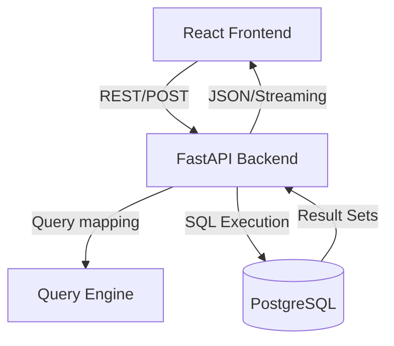

# Software Design Description (SDD) - Logistics AI Platform

**Version:** 1.0.0  
**Status:** Approved  
**Last Updated:** June 9, 2026

## 1. Introduction
The Logistics AI Platform is a full-stack solution designed to provide natural language access to complex logistics data. It enables non-technical users to query shipment, route, claim, and invoice data using plain English, which is then translated into SQL and visualized in a professional dashboard.

## 2. System Architecture
The system follows a classic three-tier architecture:
- **Presentation Layer:** React + Vite (Frontend)
- **Application Layer:** FastAPI (Backend)
- **Data Layer:** PostgreSQL (Database)

### 2.1 Component Diagram

## 3. Design Principles
- **Aesthetics First:** Premium dark/light themes with high-quality SVG icons.
- **Scalability:** Optimized for handling 100K+ shipment records.
- **Security:** Environment-based configuration and safe SQL execution (to be enhanced with sanitization).
- **Extensibility:** LLM-ready query engine interface.

## 4. Documentation Index
The following specifications provide detailed implementation details for each subsystem:

1. [Database Specification](./Database_Spec.md) - Schema design and seeding protocols.
2. [Backend API Specification](./Backend_API_Spec.md) - API endpoints and service logic.
3. [Frontend UI Specification](./Frontend_UI_Spec.md) - Component library and theme system.
4. [Query Engine Specification](./Query_Engine_Spec.md) - Natural language to SQL mapping logic.

## 5. Deployment Strategy
- **Containerization:** Ready for Docker orchestration.
- **Environment Management:** Multi-stage `.env` configuration.
- **CI/CD:** GitHub Actions integration for automated testing.
